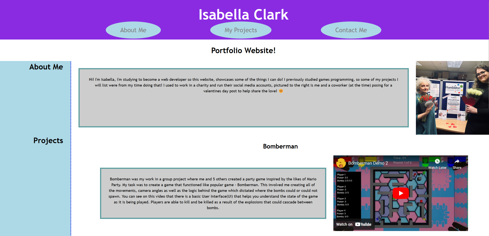
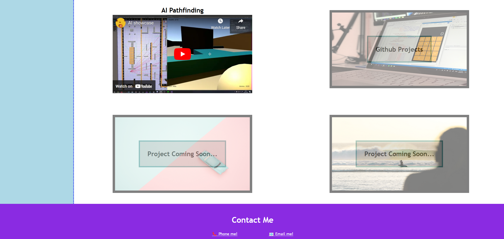

# Portfolio-Website

# Description

 Creating a Portfolio Website using HTML and CSS to showcase some of my projects and to act as a starting point to improve throughout my time on the course. 
 
# Installation

Open the link in a modern browser (Tested on Firefox and Chrome): (https://therandommer.github.io/Portfolio-Website/)

# Usage

When you open the site in your browser you should see a site that looks like the screenshots in the below:

## Mobile

## Desktop

## License

Using MIT License.
